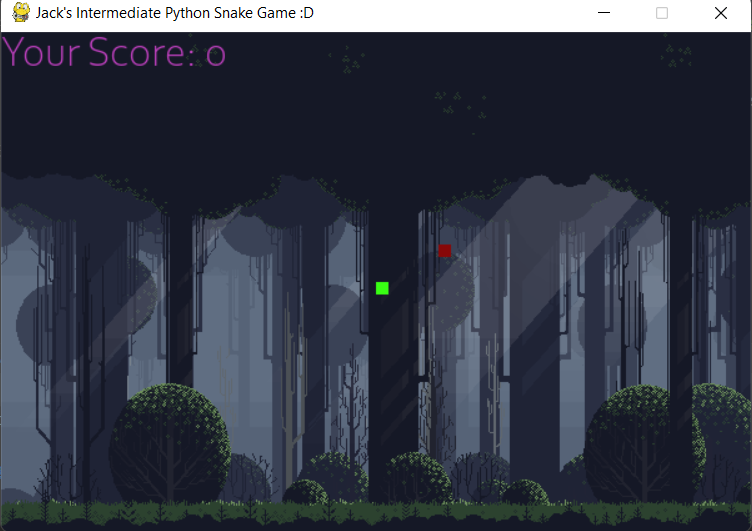
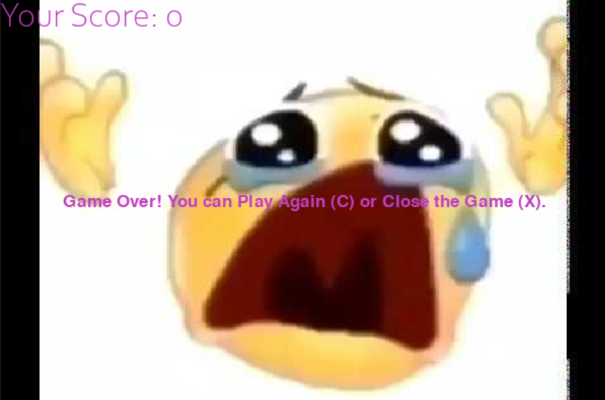

# Jack127
**Jack's Final Snake Project**

**What does it do?**
This program is the classic game of Snake created in Python. It is pretty basic allowing the user to control
the snake (green block) with the arrow keys trying to eat as much food (red blocks) as possible without 
crashing into either the boundary of the map or their own body as they continue to grow! The game has a few 
features such as displaying the user's score in the top left corner and allowing them to play again with C 
or close the game X after each round. 

**How does it run**
It utilizes the random method to randomly position the food along with the
time and pygame libraries to create and run the game. There is also some fun with image files and sound 
effects within the game.

**Issues I ran into and things I would like to come back to**
It took me quite a while to get things working properly because this is only the second time I have 
worked with pygame, but I feel much more confident with it now! Figuring out image files and sound effects
was a battle and the sound effects still give issue sometime despite everything else about the game working.
I would like to come back at some point and implement sprites for the food and 
the snake rather than just colored blocks and ensure the sounds are working without hindering the game's
performance. 

**How to run**
Just install the zip with all the image and sound files off GitHub and click run there isn't anything too 
fancy involved in the setup of this program. Ensure that pygame is installed on your device before you 
begin otherwise the game will not work.

**How to play**
The player controls the green square (the snake) with the arrow keys using up down left and right to move 
it around the screen. The goal is to eat as many of the red food blocks as possible without running into 
the boundaries of the screen, or colliding with the snakes body as every piece of food it eats causes the 
snake to grow longer. If the game ends, you can either press C to play again, or you can press X (or click
the X in the top right) to close the game. (Reference the screenshot below: img_1 is gameplay screen, img is loss 
screen)

**Credits**
Professor Salu for teaching me Python
Blarji and Polymars on YouTube (they code games on YouTube and provide helpful insight into the game
development process)
Pygame and Python Documentation
Music Used: BTD5 Main Menu Theme, Gaming Fart Sound Effect

